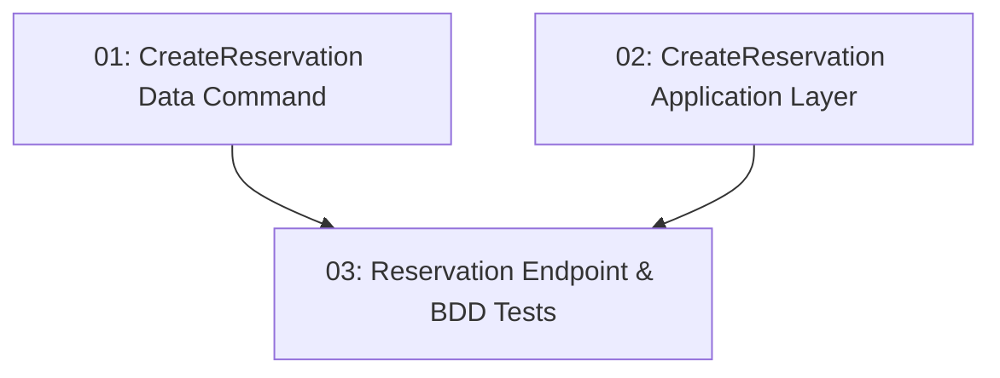

# Reservation Creation — Backend

## Overview

This feature adds the `POST /api/reservations` endpoint to TableNow, allowing an authenticated diner to book a time slot. It uses EF Core optimistic concurrency on `TimeSlot.RowVersion` to prevent double-booking: two simultaneous requests for the last available slot will result in exactly one 201 and one 409. The slot's `RemainingCapacity` is decremented atomically in the same database transaction that creates the reservation record.

## Quick Links

- [Requirements](./requirements.md) — full requirements and acceptance criteria
- [Action Required](./action-required.md) — manual steps needing human action
- [Implementation Plan](./implementation-plan.md) — phased task checklist

## Dependency Graph

## Phases

| Phase | Tasks | Description |
|------|-------|-------------|
| 1 | task-01, task-02 | Data-layer command with optimistic concurrency logic (task-01) and Application-layer handler (task-02) — different layers, run in parallel. |
| 2 | task-03 | Minimal API endpoint with JWT auth, `ReservationsMapper`, and BDD tests for the capacity-exceeded and happy-path cases. |

## Task Status

### Phase 1
- [ ] [task-01-create-reservation-command](./tasks/task-01-create-reservation-command.md) — `CreateReservationCommand` with optimistic concurrency
- [ ] [task-02-create-reservation-application](./tasks/task-02-create-reservation-application.md) — `CreateReservationRequest` / handler

### Phase 2
- [ ] [task-03-reservation-endpoint](./tasks/task-03-reservation-endpoint.md) — `POST /api/reservations` endpoint + BDD tests
