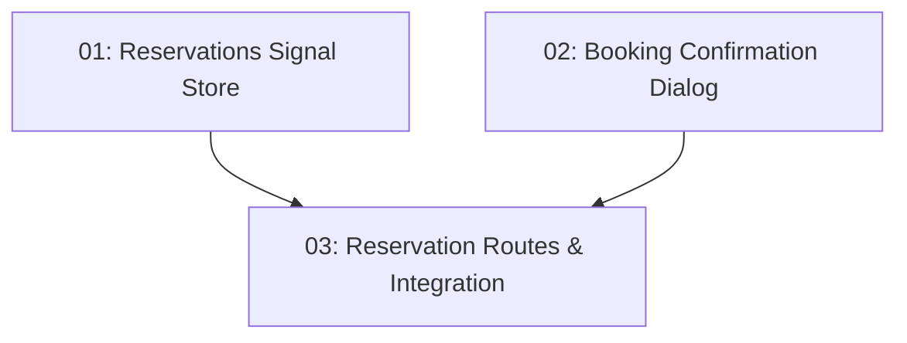

# Reservation Creation — Frontend

## Overview

This feature delivers the diner-facing booking confirmation experience for TableNow. After a diner picks an available time slot on the restaurant detail page (delivered by STORY-013), this feature shows a confirmation step that displays the restaurant name, date, time, and party size before committing. On confirmation it POSTs to `/api/reservations` (the backend from STORY-014), shows a loading state, and on success navigates the user to "My Reservations" with a success toast. When the slot is no longer available (409 Conflict), it surfaces an error and refreshes the slot list. State is owned by a new `reservations.store.ts` NgRx Signal Store slice in the `reservations` feature.

## Quick Links

- [Requirements](./requirements.md) — full requirements and acceptance criteria
- [Action Required](./action-required.md) — manual steps needing human action
- [Implementation Plan](./implementation-plan.md) — phased task checklist

## Dependency Graph

> Note: tasks 01 and 02 run in parallel in Phase 1. Task 02 consumes the store contract documented in task 01 but creates files in a separate `components/` folder, so there is no file overlap. Task 03 wires both together into routes and the slot-selection flow.

## Phases

| Phase | Tasks | Description |
|------|-------|-------------|
| 1 | task-01, task-02 | Build the `reservations.store.ts` Signal Store slice (state + `createReservation` / `clearSelectedSlot` actions, 409 handling) and the `BookingConfirmationComponent` Material dialog (review details, confirm button with loading state, success/409 handling). The two tasks touch disjoint folders. |
| 2 | task-03 | Define the reservation feature routes, integrate the confirmation dialog into the slot-selection flow, and add the feature barrel export. |

## Task Status

### Phase 1
- [ ] [task-01-reservations-store](./tasks/task-01-reservations-store.md) — `reservations.store.ts` NgRx Signal Store slice with booking state and 409 handling
- [ ] [task-02-booking-confirmation-dialog](./tasks/task-02-booking-confirmation-dialog.md) — `BookingConfirmationComponent` Material dialog with confirm + loading state

### Phase 2
- [ ] [task-03-reservation-routes](./tasks/task-03-reservation-routes.md) — Reservation feature routes, slot-selection integration, and barrel export
