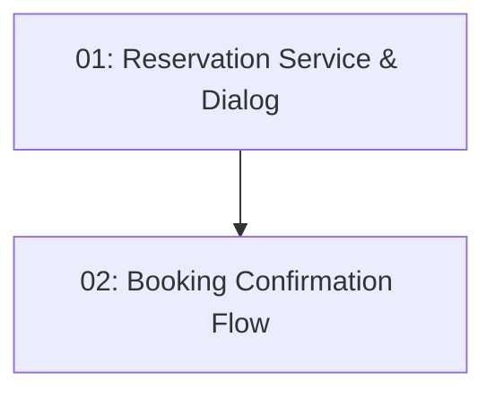

# Story 015: Reservation Creation — Frontend

## Overview

Adds the booking confirmation flow to the restaurant detail page. When a diner clicks a time slot, a Material Dialog pops up showing booking details. Confirming posts to `POST /api/reservations`. Success navigates to `/reservations` with a toast. A 409 closes the dialog and refreshes the slot list.

## Quick Links

- [Requirements](./requirements.md)
- [Action Required](./action-required.md)

## Dependency Graph

## Phases

| Phase | Tasks | Description |
|-------|-------|-------------|
| 1 | task-01 | ReservationService + confirmation dialog component |
| 2 | task-02 | Wire dialog into restaurant-detail component |

## Task Status

### Phase 1
- [ ] [task-01-reservation-service](./tasks/task-01-reservation-service.md) — Service and confirmation dialog component

### Phase 2
- [ ] [task-02-booking-confirmation-flow](./tasks/task-02-booking-confirmation-flow.md) — Slot click → dialog → POST → navigate
