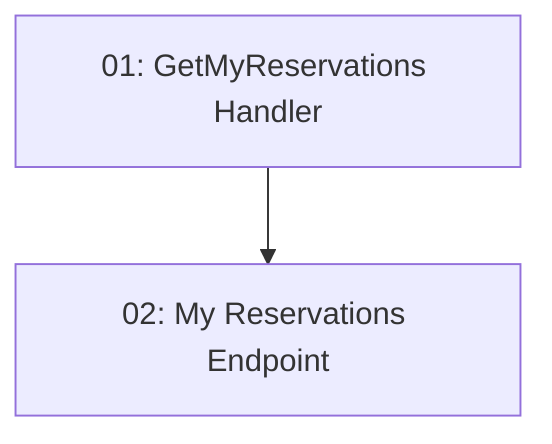

# Story 016: My Reservations Dashboard — Backend

## Overview

Implements `GET /api/reservations/my` which returns all reservations for the authenticated user. Joins Reservation → TimeSlot → Restaurant to produce the display data. Returns an empty array (not 404) when the user has no reservations. `userId` read exclusively from JWT claims.

## Quick Links

- [Requirements](./requirements.md)
- [Action Required](./action-required.md)

## Dependency Graph

## Phases

| Phase | Tasks | Description |
|-------|-------|-------------|
| 1 | task-01 | Query + Application handler |
| 2 | task-02 | GET /api/reservations/my endpoint |

## Task Status

### Phase 1
- [ ] [task-01-get-my-reservations-handler](./tasks/task-01-get-my-reservations-handler.md) — GetMyReservationsQuery and handler

### Phase 2
- [ ] [task-02-my-reservations-endpoint](./tasks/task-02-my-reservations-endpoint.md) — GET /my endpoint
