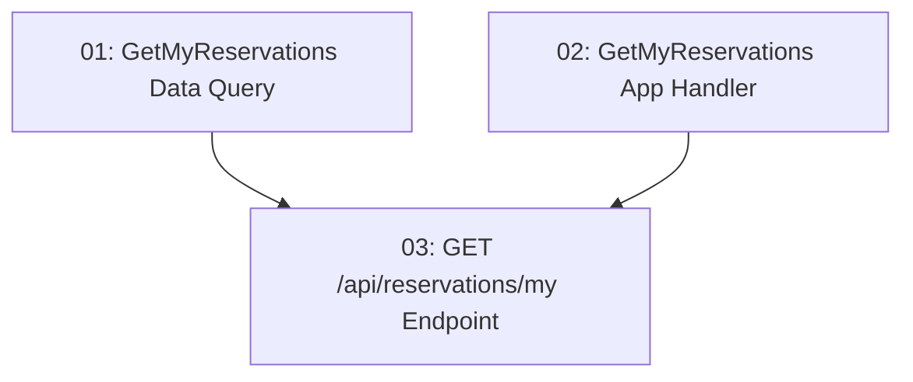

# My Reservations Dashboard — Backend

## Overview

This feature delivers the read API that powers the diner's "My Reservations" dashboard: `GET /api/reservations/my`. It returns every reservation belonging to the authenticated user, joining `Reservation` with `TimeSlot` and `Restaurant` so each item carries the restaurant name, date, time, party size, and status. The user identity comes exclusively from the JWT claims — never from the request body. The endpoint is protected (401 for unauthenticated callers) and returns an empty array with 200 for a user who has no reservations. Built as a Data-layer query, an Application-layer request/handler, and a Minimal API endpoint per the modular-monolith CQRS flow.

## Quick Links

- [Requirements](./requirements.md) — full requirements and acceptance criteria
- [Action Required](./action-required.md) — manual steps needing human action
- [Implementation Plan](./implementation-plan.md) — phased task checklist

## Dependency Graph

> Note: tasks 01 and 02 run in parallel in Phase 1. Task 02 references the data query's request/response *contract* (documented in task 01) but creates files in the Application layer, so there is no file overlap. Task 03 composes both and exposes the HTTP endpoint.

## Phases

| Phase | Tasks | Description |
|------|-------|-------------|
| 1 | task-01, task-02 | Build the `GetMyReservationsQuery`/handler in the Data layer (JOIN Reservation + TimeSlot + Restaurant) and the `GetMyReservationsRequest`/handler in the Application layer (reads `userId` from JWT claims, dispatches the data query). |
| 2 | task-03 | Map the `GET /api/reservations/my` Minimal API endpoint with `RequireAuthorization()`, using `ReservationMapper` and `TypedResultHelper`. |

## Task Status

### Phase 1
- [ ] [task-01-get-reservations-data](./tasks/task-01-get-reservations-data.md) — `GetMyReservationsQuery` Data handler joining Reservation + TimeSlot + Restaurant
- [ ] [task-02-get-reservations-application](./tasks/task-02-get-reservations-application.md) — `GetMyReservationsRequest` Application handler reading `userId` from JWT claims

### Phase 2
- [ ] [task-03-my-reservations-endpoint](./tasks/task-03-my-reservations-endpoint.md) — `GET /api/reservations/my` protected Minimal API endpoint
