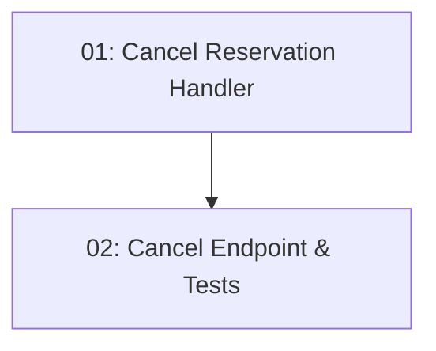

# Story 017: Reservation Cancellation — Backend

## Overview

Implements `DELETE /api/reservations/{id}` — cancels a reservation and restores the slot's capacity. Owner check prevents cancelling another user's reservation (403). Cancelling an already-cancelled reservation returns 409. The status update and capacity restore happen in one transaction.

## Quick Links

- [Requirements](./requirements.md)
- [Action Required](./action-required.md)

## Dependency Graph

## Phases

| Phase | Tasks | Description |
|-------|-------|-------------|
| 1 | task-01 | CancelReservationCommand + handler |
| 2 | task-02 | DELETE endpoint + BDD tests |

## Task Status

### Phase 1
- [ ] [task-01-cancel-reservation-handler](./tasks/task-01-cancel-reservation-handler.md) — Command with ownership check and capacity restore

### Phase 2
- [ ] [task-02-cancel-endpoint](./tasks/task-02-cancel-endpoint.md) — DELETE endpoint + BDD tests
