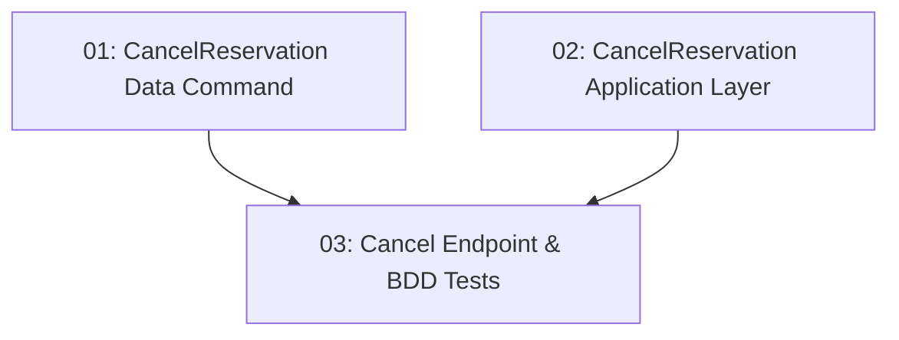

# Reservation Cancellation — Backend

## Overview

This feature adds the `DELETE /api/reservations/{id}` endpoint that allows a diner to cancel their own reservation. Cancellation atomically sets `Reservation.Status = Cancelled` and restores `TimeSlot.RemainingCapacity` by `PartySize` within a single transaction. Authorization is enforced: only the reservation owner (matched via JWT `userId` claim) can cancel; a different user's attempt returns 403. Double-cancellation returns 409.

## Quick Links

- [Requirements](./requirements.md) — full requirements and acceptance criteria
- [Action Required](./action-required.md) — manual steps needing human action
- [Implementation Plan](./implementation-plan.md) — phased task checklist

## Dependency Graph

## Phases

| Phase | Tasks | Description |
|------|-------|-------------|
| 1 | task-01, task-02 | Data command (task-01) and Application handler (task-02) — different layers, fully parallel. |
| 2 | task-03 | DELETE endpoint, ownership check, and BDD tests for the non-owner forbidden case. |

## Task Status

### Phase 1
- [ ] [task-01-cancel-reservation-command](./tasks/task-01-cancel-reservation-command.md) — `CancelReservationCommand` with atomic status update + capacity restore
- [ ] [task-02-cancel-reservation-application](./tasks/task-02-cancel-reservation-application.md) — `CancelReservationRequest` / handler with ownership check

### Phase 2
- [ ] [task-03-cancel-endpoint](./tasks/task-03-cancel-endpoint.md) — `DELETE /api/reservations/{id}` + BDD tests
