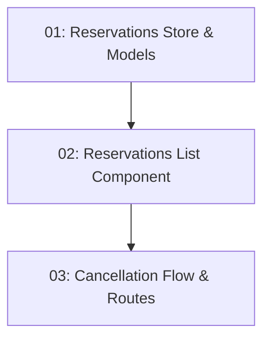

# My Reservations Dashboard — Frontend

## Overview

This feature adds the `/reservations` route to the Angular client where authenticated diners can view all their reservations and cancel confirmed ones. State is managed by a NgRx Signal Store slice. The route is guarded by `AuthGuard` from STORY-009. Cancellation includes a confirmation prompt before issuing the DELETE request; on success the reservation status updates to "Cancelled" in the store.

## Quick Links

- [Requirements](./requirements.md) — full requirements and acceptance criteria
- [Action Required](./action-required.md) — manual steps needing human action
- [Implementation Plan](./implementation-plan.md) — phased task checklist

## Dependency Graph

## Phases

| Phase | Tasks | Description |
|------|-------|-------------|
| 1 | task-01 | NgRx Signal Store slice, service, and TypeScript models for reservations. |
| 2 | task-02 | Reservations list component with status badge and cancel button. |
| 3 | task-03 | Cancellation confirmation dialog, DELETE API call, and route wiring with AuthGuard. |

## Task Status

### Phase 1
- [ ] [task-01-reservations-store](./tasks/task-01-reservations-store.md) — Signal Store, service, and models

### Phase 2
- [ ] [task-02-reservations-list-component](./tasks/task-02-reservations-list-component.md) — Reservations list with status badges

### Phase 3
- [ ] [task-03-cancellation-routes](./tasks/task-03-cancellation-routes.md) — Cancel flow + route + AuthGuard
