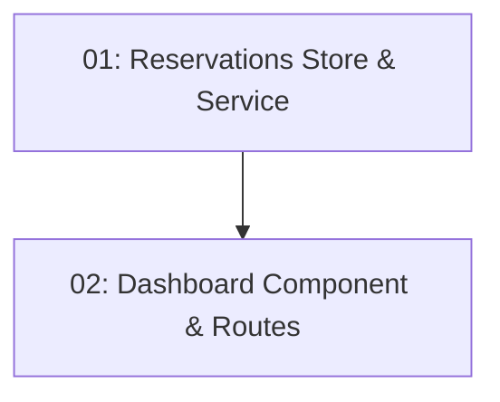

# Story 018: My Reservations Dashboard — Frontend

## Overview

Creates the `/reservations` route showing a list of the authenticated user's reservations with status badges and a cancel button. Cancel triggers a confirmation dialog then calls `DELETE /api/reservations/{id}`. Route is protected by the `authGuard` from STORY-009.

## Quick Links

- [Requirements](./requirements.md)
- [Action Required](./action-required.md)

## Dependency Graph

## Phases

| Phase | Tasks | Description |
|-------|-------|-------------|
| 1 | task-01 | NgRx Signal Store + ReservationsService |
| 2 | task-02 | Dashboard component with cancel flow + route config |

## Task Status

### Phase 1
- [ ] [task-01-reservations-store](./tasks/task-01-reservations-store.md) — NgRx Signal Store and service

### Phase 2
- [ ] [task-02-reservations-dashboard-component](./tasks/task-02-reservations-dashboard-component.md) — Dashboard with cancel flow and guarded route
