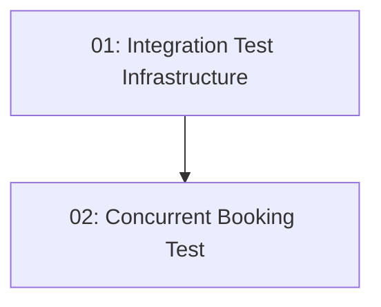

# Story 019: Concurrency Integration Test

## Overview

Proves the double-booking prevention works end-to-end. Fires two simultaneous POST /api/reservations requests using `Task.WhenAll` against a real (or in-memory) database. Asserts exactly one 201 and one 409. Uses `WebApplicationFactory<Program>` for the test host.

## Quick Links

- [Requirements](./requirements.md)
- [Action Required](./action-required.md)

## Dependency Graph

## Phases

| Phase | Tasks | Description |
|-------|-------|-------------|
| 1 | task-01 | api_fixture base class and test helpers |
| 2 | task-02 | Concurrent booking test implementation |

## Task Status

### Phase 1
- [ ] [task-01-integration-test-infra](./tasks/task-01-integration-test-infra.md) — api_fixture and test helpers

### Phase 2
- [ ] [task-02-concurrent-booking-test](./tasks/task-02-concurrent-booking-test.md) — describe_concurrent_booking test
