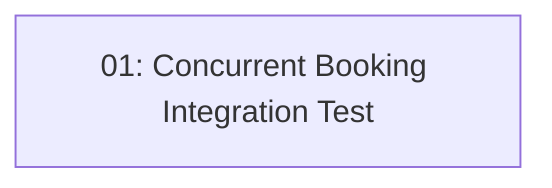

# Concurrency Integration Test

## Overview

This feature adds an integration test that fires two simultaneous `POST /api/reservations` requests for the same fully-stocked time slot and asserts that exactly one returns 201 and the other returns 409. It proves that the optimistic concurrency mechanism in STORY-014 provably prevents double-booking. The test uses `WebApplicationFactory<Program>` and a real test database (SQLite in-memory or Testcontainers SQL Server).

## Quick Links

- [Requirements](./requirements.md) — full requirements and acceptance criteria
- [Action Required](./action-required.md) — manual steps needing human action
- [Implementation Plan](./implementation-plan.md) — phased task checklist

## Dependency Graph

## Phases

| Phase | Tasks | Description |
|------|-------|-------------|
| 1 | task-01 | Single integration test class firing two concurrent reservation requests and asserting exactly one 201 + one 409. |

## Task Status

### Phase 1
- [ ] [task-01-concurrency-test](./tasks/task-01-concurrency-test.md) — `describe_concurrent_booking` integration test
