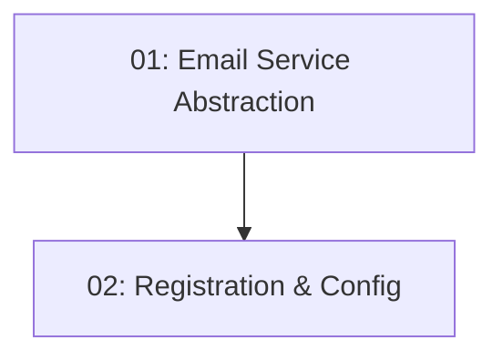

# Story 020: Email Service Integration

## Overview

Creates the `IEmailService` abstraction and `SendGridEmailService` implementation in `Infrastructure/Notifications/`. Adds Polly retry for transient failures. Registers the service with configuration binding for the API key. Foundation for STORY-021 (booking confirmation) and STORY-022 (reminders).

## Quick Links

- [Requirements](./requirements.md)
- [Action Required](./action-required.md)

## Dependency Graph

## Phases

| Phase | Tasks | Description |
|-------|-------|-------------|
| 1 | task-01 | Interface + SendGrid implementation |
| 2 | task-02 | DI registration and config |

## Task Status

### Phase 1
- [ ] [task-01-email-service-abstraction](./tasks/task-01-email-service-abstraction.md) — IEmailService and SendGridEmailService

### Phase 2
- [ ] [task-02-email-registration](./tasks/task-02-email-registration.md) — Options binding and DI registration
