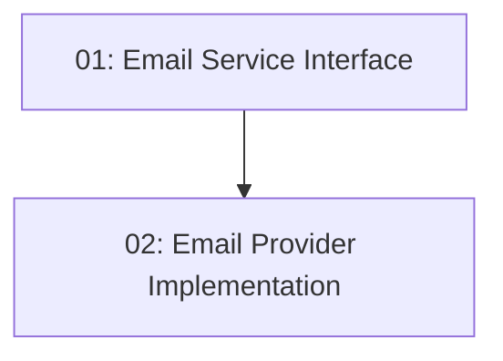

# Email Service Integration

## Overview

Provides a provider-agnostic email service abstraction (`IEmailService`) backed by a transactional email provider (SendGrid or Mailgun), so that downstream notification features — booking confirmations and reminder emails — can send reliable HTML emails. The abstraction isolates the rest of the codebase from any specific provider, supports retry on transient failures, and ensures email delivery failures never crash the booking flow.

## Quick Links

- [Requirements](./requirements.md) — full requirements and acceptance criteria
- [Action Required](./action-required.md) — manual steps needing human action
- [Implementation Plan](./implementation-plan.md) — phased task checklist

## Dependency Graph

## Phases

| Phase | Tasks | Description |
|------|-------|-------------|
| 1 | task-01, task-02 | Define the `IEmailService` abstraction and `EmailOptions`, then provide a concrete provider implementation with retry and logging, registered via `RegisterNotificationsModule()`. |

> Note: task-02 depends on the interface defined in task-01. They are written together but task-02 must be implemented after task-01.

## Task Status

### Phase 1
- [ ] [task-01-email-service-interface](./tasks/task-01-email-service-interface.md) — Define `IEmailService` and `EmailOptions` in `Infrastructure/Notifications/`
- [ ] [task-02-email-provider-implementation](./tasks/task-02-email-provider-implementation.md) — Concrete provider implementation with Polly retry and module registration
