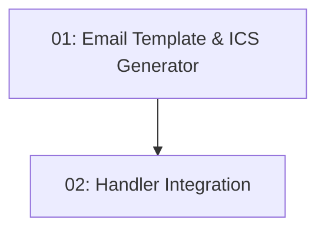

# Story 021: Booking Confirmation Email

## Overview

Sends an HTML confirmation email with a `.ics` calendar attachment after a successful reservation. Triggered inside `CreateReservationRequestHandler` after a 201 is produced. Email failure is logged but must NOT roll back the reservation.

## Quick Links

- [Requirements](./requirements.md)
- [Action Required](./action-required.md)

## Dependency Graph

## Phases

| Phase | Tasks | Description |
|-------|-------|-------------|
| 1 | task-01 | HTML template + .ics file generator |
| 2 | task-02 | Trigger from CreateReservationRequestHandler |

## Task Status

### Phase 1
- [ ] [task-01-email-template](./tasks/task-01-email-template.md) — BookingConfirmation.html and IcsGenerator

### Phase 2
- [ ] [task-02-handler-integration](./tasks/task-02-handler-integration.md) — Send email in CreateReservationRequestHandler
