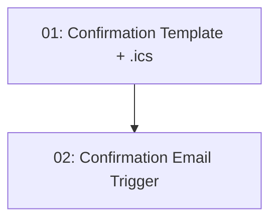

# Booking Confirmation Email

## Overview

Sends an HTML confirmation email with a calendar invite after a diner books a reservation. The email includes the restaurant name, date, time, and party size, an attached `.ics` iCalendar file the diner can add to their calendar, and a Google Maps directions link built from the restaurant's address. Email sending is triggered after a successful reservation is created and runs in a fire-and-forget / background manner so that any email failure never fails the booking itself.

## Quick Links

- [Requirements](./requirements.md) — full requirements and acceptance criteria
- [Action Required](./action-required.md) — manual steps needing human action
- [Implementation Plan](./implementation-plan.md) — phased task checklist

## Dependency Graph

## Phases

| Phase | Tasks | Description |
|------|-------|-------------|
| 1 | task-01, task-02 | Author the HTML template + `.ics` generation + Maps link helper, then trigger `IEmailService.SendAsync()` from the reservation handler without coupling email success to booking success. |

> Note: task-02 consumes the template and `.ics` builder produced by task-01.

## Task Status

### Phase 1
- [ ] [task-01-confirmation-email-template](./tasks/task-01-confirmation-email-template.md) — HTML template, `.ics` iCalendar attachment generation, Google Maps directions URL
- [ ] [task-02-confirmation-email-trigger](./tasks/task-02-confirmation-email-trigger.md) — Trigger the confirmation email from `CreateReservationRequestHandler` (fire-and-forget)
