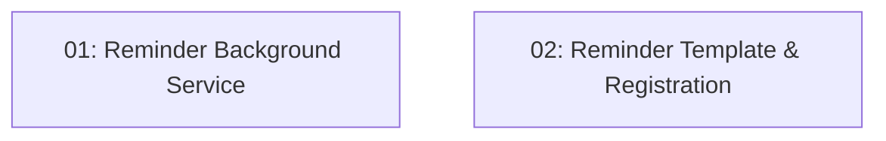

# Story 022: 24-Hour Reminder Email

## Overview

Adds a `BackgroundService` that runs every 15 minutes and sends reminder emails to diners with reservations 24 hours away. Sets `ReminderSent = true` after a successful send to prevent duplicates. Email failures are logged and retried on the next run.

## Quick Links

- [Requirements](./requirements.md)
- [Action Required](./action-required.md)

## Dependency Graph

## Phases

| Phase | Tasks | Description |
|-------|-------|-------------|
| 1 | task-01, task-02 | Background service (task-01) and template+registration (task-02) — parallel, different files |

## Task Status

### Phase 1
- [ ] [task-01-reminder-service](./tasks/task-01-reminder-service.md) — ReminderBackgroundService
- [ ] [task-02-reminder-template](./tasks/task-02-reminder-template.md) — Reminder.html template and registration
