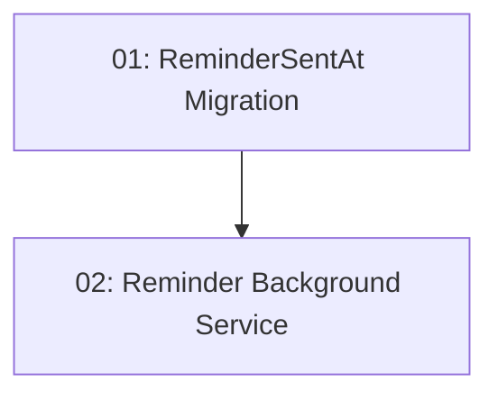

# 24-Hour Reminder Email

## Overview

Sends a reminder email roughly 24 hours before a confirmed reservation so diners don't forget their booking. A `BackgroundService` runs on a schedule (every 15 minutes), queries confirmed reservations whose slot time falls within a window around 24 hours out and that have not already been reminded, sends the reminder via `IEmailService`, and records `ReminderSentAt` to prevent duplicate emails. Cancelled reservations are excluded.

## Quick Links

- [Requirements](./requirements.md) — full requirements and acceptance criteria
- [Action Required](./action-required.md) — manual steps needing human action
- [Implementation Plan](./implementation-plan.md) — phased task checklist

## Dependency Graph

## Phases

| Phase | Tasks | Description |
|------|-------|-------------|
| 1 | task-01, task-02 | Add the `ReminderSentAt` tracking column + migration, then implement the scheduled `BackgroundService` that sends reminders and marks them sent. |

> Note: task-02 reads/writes the `ReminderSentAt` column introduced in task-01.

## Task Status

### Phase 1
- [ ] [task-01-reminder-tracking-migration](./tasks/task-01-reminder-tracking-migration.md) — Add nullable `ReminderSentAt` column to `Reservation` + EF migration
- [ ] [task-02-reminder-background-service](./tasks/task-02-reminder-background-service.md) — Scheduled `BackgroundService` that sends reminders and updates `ReminderSentAt`
