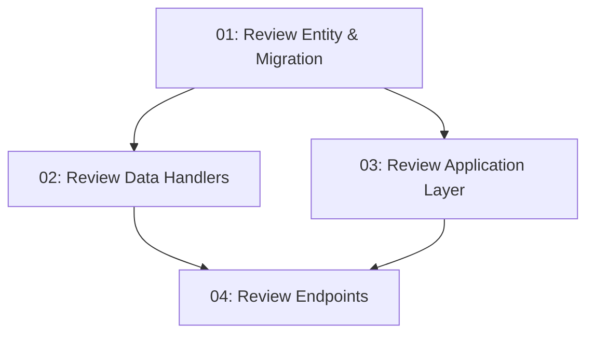

# User Reviews — Backend

## Overview

This feature adds review submission and retrieval APIs to TableNow. Authenticated diners can POST a star rating (1–5) and text review to `POST /api/restaurants/{id}/reviews`. The `GET /api/restaurants/{id}/reviews` endpoint returns paginated reviews sorted newest-first. A `Review` entity and EF migration are added; the restaurant detail endpoint is extended to include the most recent reviews.

## Quick Links

- [Requirements](./requirements.md) — full requirements and acceptance criteria
- [Action Required](./action-required.md) — manual steps needing human action
- [Implementation Plan](./implementation-plan.md) — phased task checklist

## Dependency Graph

## Phases

| Phase | Tasks | Description |
|------|-------|-------------|
| 1 | task-01 | `Review` domain entity, EF model, Fluent config, and migration. |
| 2 | task-02, task-03 | Data handlers (task-02) and Application handlers (task-03) — different layers, parallel. |
| 3 | task-04 | Minimal API endpoints for review creation and listing. |

## Task Status

### Phase 1
- [ ] [task-01-review-entity-migration](./tasks/task-01-review-entity-migration.md) — `Review` entity, EF model, and migration

### Phase 2
- [ ] [task-02-review-data-handlers](./tasks/task-02-review-data-handlers.md) — `CreateReviewCommand` and `GetReviewsQuery`
- [ ] [task-03-review-application-layer](./tasks/task-03-review-application-layer.md) — `SubmitReviewRequest` and `GetReviewsRequest` handlers

### Phase 3
- [ ] [task-04-review-endpoints](./tasks/task-04-review-endpoints.md) — `POST` and `GET` review endpoints
