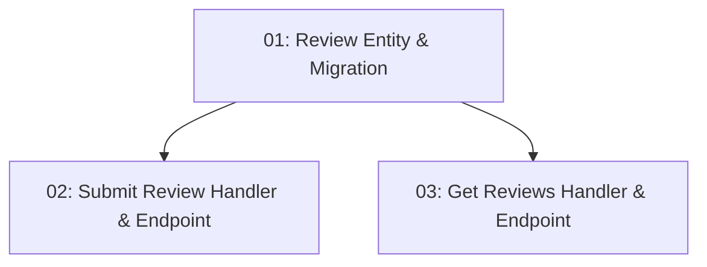

# Story 023: User Reviews — Backend

## Overview

Adds a `Review` entity and two endpoints: `POST /api/restaurants/{id}/reviews` (submit a rating + text) and `GET /api/restaurants/{id}/reviews` (paginated, newest first). Any authenticated user can submit a review. `GET /api/restaurants/{id}` response is also updated to include the most recent reviews.

## Quick Links

- [Requirements](./requirements.md)
- [Action Required](./action-required.md)

## Dependency Graph

## Phases

| Phase | Tasks | Description |
|-------|-------|-------------|
| 1 | task-01 | Review entity, EF config, migration |
| 2 | task-02, task-03 | Submit endpoint (task-02) and Get endpoint (task-03) — parallel |

## Task Status

### Phase 1
- [ ] [task-01-review-entity-migration](./tasks/task-01-review-entity-migration.md) — Review entity and EF migration

### Phase 2
- [ ] [task-02-submit-review-handler-endpoint](./tasks/task-02-submit-review-handler-endpoint.md) — POST /api/restaurants/{id}/reviews
- [ ] [task-03-get-reviews-handler-endpoint](./tasks/task-03-get-reviews-handler-endpoint.md) — GET /api/restaurants/{id}/reviews
