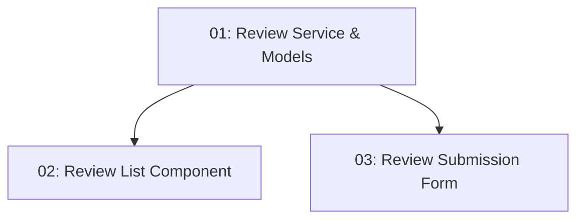

# User Reviews — Frontend

## Overview

This feature extends the restaurant detail page (`/restaurants/:id`) with a review section showing existing reviews and a submission form for authenticated users. Reviews are fetched from `GET /api/restaurants/{id}/reviews` and rendered with star rating, author name, and body. An authenticated diner sees a form to submit a new review; unauthenticated visitors see only the read-only list.

## Quick Links

- [Requirements](./requirements.md) — full requirements and acceptance criteria
- [Action Required](./action-required.md) — manual steps needing human action
- [Implementation Plan](./implementation-plan.md) — phased task checklist

## Dependency Graph

## Phases

| Phase | Tasks | Description |
|------|-------|-------------|
| 1 | task-01 | `Review` TypeScript model and `ReviewsService` for GET and POST. |
| 2 | task-02, task-03 | Review list (task-02) and review submission form (task-03) — both use the service from task-01 but modify different template sections. |

## Task Status

### Phase 1
- [ ] [task-01-review-service-models](./tasks/task-01-review-service-models.md) — `Review` model + `ReviewsService`

### Phase 2
- [ ] [task-02-review-list-component](./tasks/task-02-review-list-component.md) — Review list in restaurant detail
- [ ] [task-03-review-form-component](./tasks/task-03-review-form-component.md) — Authenticated review submission form
