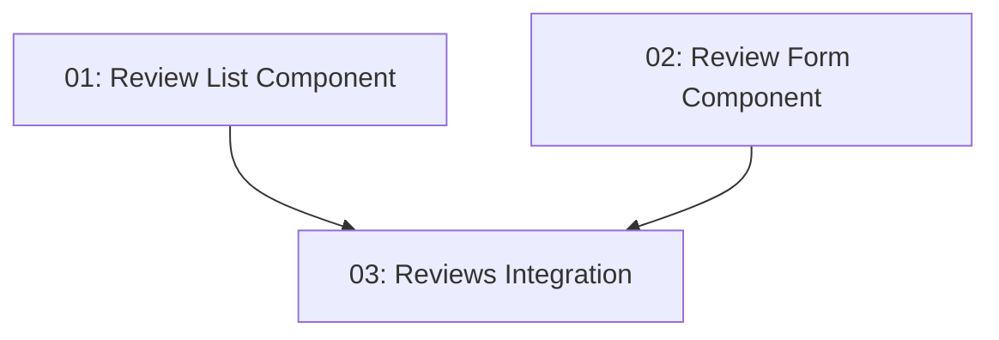

# Story 024: User Reviews — Frontend

## Overview

Adds a review section to the restaurant detail page. Authenticated users see a submission form; unauthenticated visitors see read-only reviews. The review list and form are separate components integrated into the existing detail page. Depends on STORY-023 (backend endpoints) and STORY-013 (detail page).

## Quick Links

- [Requirements](./requirements.md)
- [Action Required](./action-required.md)

## Dependency Graph

## Phases

| Phase | Tasks | Description |
|-------|-------|-------------|
| 1 | task-01, task-02 | Review list (task-01) and form (task-02) — parallel, different files |
| 2 | task-03 | Integration into restaurant-detail page |

## Task Status

### Phase 1
- [ ] [task-01-review-list-component](./tasks/task-01-review-list-component.md) — Review list display
- [ ] [task-02-review-form-component](./tasks/task-02-review-form-component.md) — Review submission form

### Phase 2
- [ ] [task-03-reviews-integration](./tasks/task-03-reviews-integration.md) — Add to restaurant detail page
