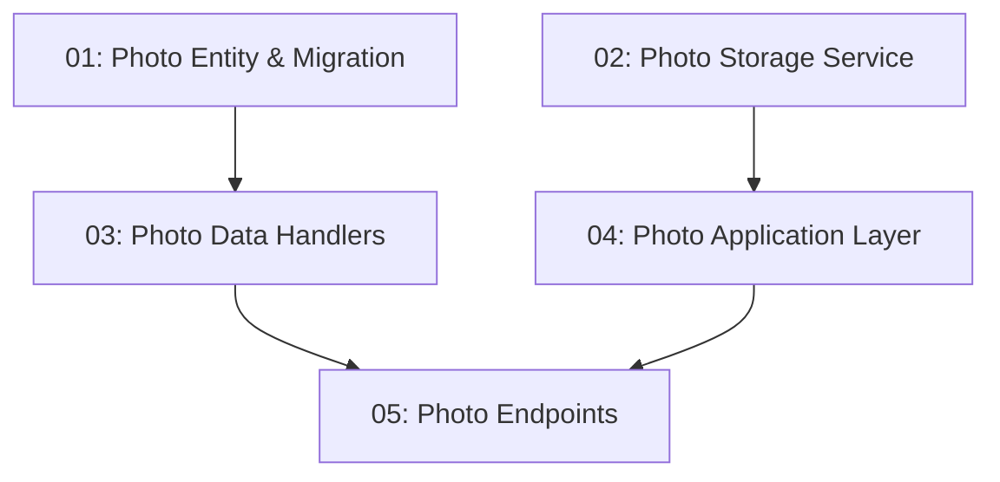

# Menu Photo Upload — Backend

## Overview

This feature allows restaurant operators to upload menu and entree photos via `POST /api/restaurants/{id}/photos`. Files are validated (≤ 5 MB, JPEG/PNG/WebP only), stored on disk (dev) or blob storage (prod), and a `Photo` entity records the URL. The `GET /api/restaurants/{id}` response is extended to include a `photos` array. Only users with `role = "Operator"` may upload.

## Quick Links

- [Requirements](./requirements.md) — full requirements and acceptance criteria
- [Action Required](./action-required.md) — manual steps needing human action
- [Implementation Plan](./implementation-plan.md) — phased task checklist

## Dependency Graph

## Phases

| Phase | Tasks | Description |
|------|-------|-------------|
| 1 | task-01, task-02 | `Photo` entity + migration (task-01) and photo storage abstraction (task-02) — fully parallel. |
| 2 | task-03, task-04 | Data handlers (task-03) and Application handlers (task-04) — different layers, parallel. |
| 3 | task-05 | Upload and listing endpoints with operator role check. |

## Task Status

### Phase 1
- [ ] [task-01-photo-entity-migration](./tasks/task-01-photo-entity-migration.md) — `Photo` entity, EF model, migration
- [ ] [task-02-photo-storage-service](./tasks/task-02-photo-storage-service.md) — `IPhotoStorageService` abstraction + local-disk implementation

### Phase 2
- [ ] [task-03-photo-data-handlers](./tasks/task-03-photo-data-handlers.md) — `SavePhotoCommand` and `GetPhotosQuery`
- [ ] [task-04-photo-application-layer](./tasks/task-04-photo-application-layer.md) — `UploadPhotoRequest` handler with file validation

### Phase 3
- [ ] [task-05-photo-endpoints](./tasks/task-05-photo-endpoints.md) — `POST /api/restaurants/{id}/photos` + operator role check
