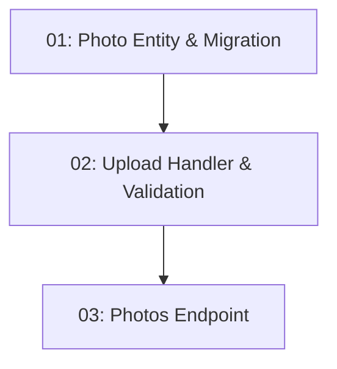

# Story 025: Menu Photo Upload — Backend

## Overview

Allows restaurant operators to upload photos (JPEG/PNG/WebP, ≤ 5MB) associated with their restaurant. Returns the photo URL on 201. Photos appear in the restaurant detail response. Operator role required (from JWT claim).

## Quick Links

- [Requirements](./requirements.md)
- [Action Required](./action-required.md)

## Dependency Graph

## Phases

| Phase | Tasks | Description |
|-------|-------|-------------|
| 1 | task-01 | Photo entity and EF migration |
| 2 | task-02 | Upload handler with validation |
| 3 | task-03 | API endpoint with operator role check |

## Task Status

### Phase 1
- [ ] [task-01-photo-entity-migration](./tasks/task-01-photo-entity-migration.md) — Photo entity and migration

### Phase 2
- [ ] [task-02-upload-handler-validation](./tasks/task-02-upload-handler-validation.md) — Upload logic and file validation

### Phase 3
- [ ] [task-03-photos-endpoint](./tasks/task-03-photos-endpoint.md) — POST endpoint with operator check
