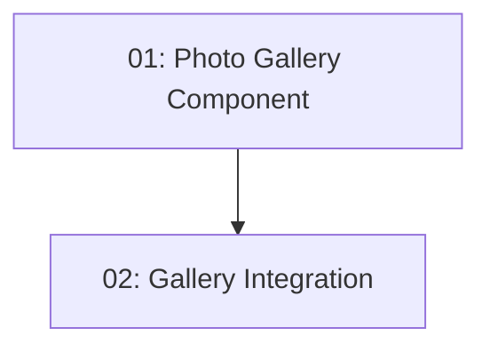

# Story 026: Photo Gallery — Frontend

## Overview

Adds a photo gallery section to the restaurant detail page. Photos lazy-load; clicking opens a lightbox. Shows skeleton placeholders while loading; no gallery section when photos array is empty. Depends on STORY-013 (detail page) and STORY-025 (photos in API response).

## Quick Links

- [Requirements](./requirements.md)
- [Action Required](./action-required.md)

## Dependency Graph

## Phases

| Phase | Tasks | Description |
|-------|-------|-------------|
| 1 | task-01 | Photo gallery component with lightbox |
| 2 | task-02 | Integration into restaurant-detail page |

## Task Status

### Phase 1
- [ ] [task-01-photo-gallery-component](./tasks/task-01-photo-gallery-component.md) — Gallery grid with lightbox

### Phase 2
- [ ] [task-02-gallery-integration](./tasks/task-02-gallery-integration.md) — Add to restaurant detail page
