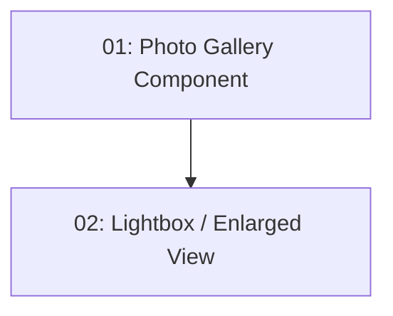

# Photo Gallery — Frontend

## Overview

This feature adds a photo gallery section to the restaurant detail page. Photos are fetched from the `photos` array in `GET /api/restaurants/{id}`. They are displayed in a grid with lazy loading; clicking a photo opens a lightbox view. A skeleton placeholder is shown while loading. If no photos are present, the section is hidden.

## Quick Links

- [Requirements](./requirements.md) — full requirements and acceptance criteria
- [Action Required](./action-required.md) — manual steps needing human action
- [Implementation Plan](./implementation-plan.md) — phased task checklist

## Dependency Graph

## Phases

| Phase | Tasks | Description |
|------|-------|-------------|
| 1 | task-01 | Photo gallery grid component with skeleton loading and conditional rendering. |
| 2 | task-02 | Lightbox/enlarged view on photo click. |

## Task Status

### Phase 1
- [ ] [task-01-photo-gallery-component](./tasks/task-01-photo-gallery-component.md) — Photo grid with lazy loading and skeleton

### Phase 2
- [ ] [task-02-lightbox-view](./tasks/task-02-lightbox-view.md) — Click-to-enlarge lightbox
