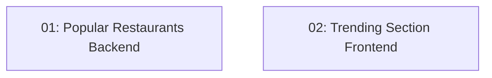

# Popularity Rankings & Favorites Section

## Overview

This feature adds a "Most Booked" section to the TableNow home page, showing the top-N restaurants ranked by confirmed reservation count for the current week or month. The backend exposes `GET /api/restaurants/popular?period=week|month&locale=` with an aggregation query on the `Reservations` table. The frontend adds a "Trending" section to the home/landing page component with a horizontal scroll or card list.

## Quick Links

- [Requirements](./requirements.md) — full requirements and acceptance criteria
- [Action Required](./action-required.md) — manual steps needing human action
- [Implementation Plan](./implementation-plan.md) — phased task checklist

## Dependency Graph

> Tasks 01 and 02 are fully independent (backend and frontend) and can be implemented in parallel.

## Phases

| Phase | Tasks | Description |
|------|-------|-------------|
| 1 | task-01, task-02 | Backend popularity endpoint (task-01) and frontend trending section (task-02) — fully parallel. |

## Task Status

### Phase 1
- [ ] [task-01-popular-backend](./tasks/task-01-popular-backend.md) — `GET /api/restaurants/popular` endpoint
- [ ] [task-02-popular-frontend](./tasks/task-02-popular-frontend.md) — Trending section on the home page
