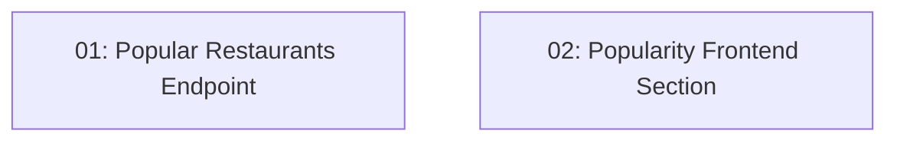

# Story 027: Popularity Rankings & Favorites Section

## Overview

Adds a "Most Booked" section ranking restaurants by confirmed reservation count. Backend exposes `GET /api/restaurants/popular?period=week|month&locale=`. Frontend shows a section on the restaurant listing page. Results are cached for 1 hour. Backend and frontend tasks are fully parallel.

## Quick Links

- [Requirements](./requirements.md)
- [Action Required](./action-required.md)

## Dependency Graph

## Phases

| Phase | Tasks | Description |
|-------|-------|-------------|
| 1 | task-01, task-02 | Backend endpoint (task-01) and frontend section (task-02) — fully parallel, different codebases |

## Task Status

### Phase 1
- [ ] [task-01-popular-restaurants-endpoint](./tasks/task-01-popular-restaurants-endpoint.md) — GET /api/restaurants/popular
- [ ] [task-02-popularity-frontend-section](./tasks/task-02-popularity-frontend-section.md) — "Most Booked" section on restaurant listing
