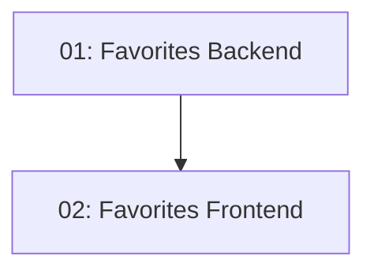

# Story 028: Personal Bookmarks / Saved Restaurants

## Overview

Authenticated diners can bookmark restaurants (toggle save/unsave). A heart/bookmark icon on restaurant cards and the detail page shows save state. A "My Favorites" section in the reservations dashboard lists saved restaurants. Requires auth for all operations; unauthenticated users are redirected to login.

## Quick Links

- [Requirements](./requirements.md)
- [Action Required](./action-required.md)

## Dependency Graph

## Phases

| Phase | Tasks | Description |
|-------|-------|-------------|
| 1 | task-01 | UserFavorite entity + POST/DELETE/GET endpoints |
| 2 | task-02 | Favorites store + heart icon on cards/detail |

## Task Status

### Phase 1
- [ ] [task-01-favorites-backend](./tasks/task-01-favorites-backend.md) — UserFavorite entity and endpoints

### Phase 2
- [ ] [task-02-favorites-frontend](./tasks/task-02-favorites-frontend.md) — Favorites store and UI
