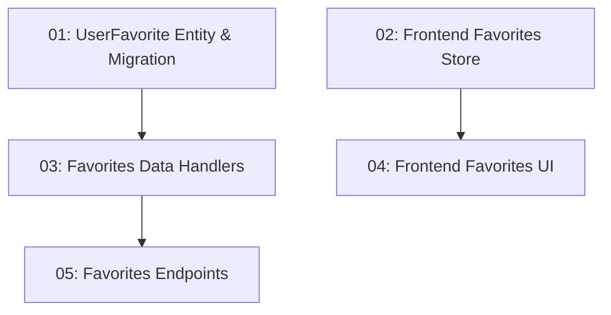

# Personal Bookmarks / Saved Restaurants

## Overview

This feature allows authenticated diners to bookmark restaurants to a personal favorites list. A heart/bookmark icon on restaurant cards and the detail page toggles the saved state. A "My Favorites" tab on the user dashboard lists all saved restaurants. The backend adds a `UserFavorite` entity and `POST`/`DELETE /api/favorites/{restaurantId}` endpoints. Frontend state is managed by a `FavoritesStore` NgRx Signal Store slice.

## Quick Links

- [Requirements](./requirements.md) — full requirements and acceptance criteria
- [Action Required](./action-required.md) — manual steps needing human action
- [Implementation Plan](./implementation-plan.md) — phased task checklist

## Dependency Graph

## Phases

| Phase | Tasks | Description |
|------|-------|-------------|
| 1 | task-01, task-02 | Backend entity + migration (task-01) and frontend store (task-02) — fully parallel. |
| 2 | task-03, task-04 | Backend data handlers (task-03) and frontend UI integration (task-04) — different concerns, parallel. |
| 3 | task-05 | Backend application layer + endpoints. |

## Task Status

### Phase 1
- [ ] [task-01-favorite-entity](./tasks/task-01-favorite-entity.md) — `UserFavorite` entity + EF migration
- [ ] [task-02-favorites-store](./tasks/task-02-favorites-store.md) — Frontend `FavoritesStore` + service

### Phase 2
- [ ] [task-03-favorite-data-handlers](./tasks/task-03-favorite-data-handlers.md) — `AddFavoriteCommand`, `RemoveFavoriteCommand`, `GetFavoritesQuery`
- [ ] [task-04-favorites-ui](./tasks/task-04-favorites-ui.md) — Heart icon on cards + "My Favorites" tab

### Phase 3
- [ ] [task-05-favorites-endpoints](./tasks/task-05-favorites-endpoints.md) — `POST`/`DELETE /api/favorites/{restaurantId}` + `GET /api/favorites`
