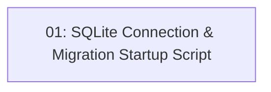

# Dev Startup: SQLite Data Connection & Migration Script

## Overview

Completes the SQLite wiring for all three business contexts and introduces a migration shell script so developers can bring the database up to date with a single command before starting the application. The `ReservationsDbContext` is currently not registered in the DI container; this story closes that gap. A PowerShell script (`migrate.ps1`) runs `dotnet ef database update` against all three migration projects in dependency order and is invoked by `startup.bat` before the API process starts.

## Quick Links

- [Requirements](./requirements.md) — full requirements and acceptance criteria
- [Implementation Plan](./implementation-plan.md) — phased task checklist

## Dependency Graph

## Phases

| Phase | Tasks | Description |
|-------|-------|-------------|
| 1 | task-01 | Register ReservationsDbContext, write migrate.ps1, update startup.bat. |

## Task Status

### Phase 1

- [x] [task-01-sqlite-connection-migration-script](./tasks/task-01-sqlite-connection-migration-script.md) — SQLite DI registration for Reservations + migrate.ps1 + startup.bat update
