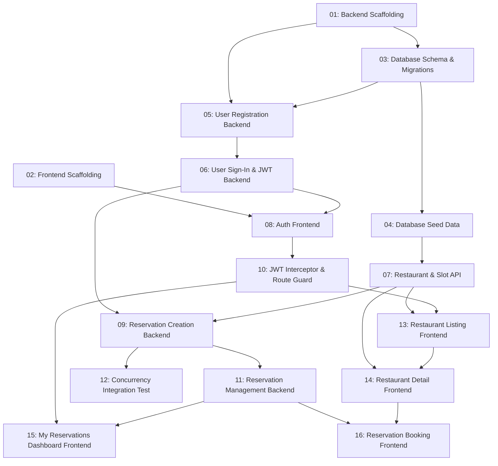

# TableNow — MVP Core Reservation Flow

## Overview

TableNow MVP delivers a complete, end-to-end restaurant reservation experience. A diner can register, browse seeded restaurants, select a date and party size, choose an available time slot, confirm a booking, view their upcoming reservations, and cancel a booking — all in a single browser session. The backend enforces atomic slot-capacity decrement and optimistic concurrency to prevent double-booking. Phase 2–4 features (notifications, reviews, favourites) are explicitly out of scope for this spec.

## Quick Links

- [Requirements](./requirements.md) — full requirements and acceptance criteria
- [Action Required](./action-required.md) — manual steps needing human action

## Dependency Graph

## Phases

| Phase | Tasks | Description |
|-------|-------|-------------|
| 1 | task-01, task-02 | Project scaffolding — .NET 10 solution + Angular 21 SPA |
| 2 | task-03 | Database schema: EF Core entities, configurations, and initial migration |
| 3 | task-04, task-05 | Seed data + Auth module (user registration handler & endpoint) |
| 4 | task-06, task-07 | Auth sign-in/JWT setup + Restaurant & Slot API endpoints |
| 5 | task-08, task-09 | Auth frontend pages + Reservation creation backend |
| 6 | task-10, task-11, task-12 | JWT interceptor/guard + Reservation management backend + Concurrency test |
| 7 | task-13 | Restaurant listing frontend (depends on interceptor and restaurant API) |
| 8 | task-14, task-15 | Restaurant detail frontend + My Reservations dashboard frontend |
| 9 | task-16 | Reservation booking confirmation frontend (full E2E flow complete) |

## Task Status

### Phase 1
- [ ] [task-01-backend-scaffolding](./tasks/task-01-backend-scaffolding.md) — .NET 10 modular monolith solution scaffold
- [ ] [task-02-frontend-scaffolding](./tasks/task-02-frontend-scaffolding.md) — Angular 21 standalone-component SPA scaffold

### Phase 2
- [ ] [task-03-database-schema](./tasks/task-03-database-schema.md) — EF Core entities, Fluent API configs, initial migration

### Phase 3
- [ ] [task-04-database-seed](./tasks/task-04-database-seed.md) — Seed 15+ restaurants, 30-day time slots, test users
- [ ] [task-05-user-registration-backend](./tasks/task-05-user-registration-backend.md) — Register endpoint with BCrypt hashing

### Phase 4
- [ ] [task-06-user-signin-jwt-backend](./tasks/task-06-user-signin-jwt-backend.md) — Login endpoint + JWT generation + middleware + CORS
- [ ] [task-07-restaurant-slot-api](./tasks/task-07-restaurant-slot-api.md) — GET /restaurants, /restaurants/{id}, /restaurants/{id}/slots

### Phase 5
- [ ] [task-08-auth-frontend](./tasks/task-08-auth-frontend.md) — Register/Login pages + AuthService + auth routes
- [ ] [task-09-reservation-creation-backend](./tasks/task-09-reservation-creation-backend.md) — POST /reservations with concurrency protection

### Phase 6
- [ ] [task-10-jwt-interceptor-guard-frontend](./tasks/task-10-jwt-interceptor-guard-frontend.md) — HTTP interceptor + canActivate route guard
- [ ] [task-11-reservation-management-backend](./tasks/task-11-reservation-management-backend.md) — GET /reservations/my + DELETE /reservations/{id}
- [ ] [task-12-concurrency-integration-test](./tasks/task-12-concurrency-integration-test.md) — Parallel booking integration test

### Phase 7
- [ ] [task-13-restaurant-listing-frontend](./tasks/task-13-restaurant-listing-frontend.md) — Restaurant grid, cuisine filter, Signal Store

### Phase 8
- [ ] [task-14-restaurant-detail-frontend](./tasks/task-14-restaurant-detail-frontend.md) — Restaurant detail + date/party form + slot list
- [ ] [task-15-my-reservations-dashboard-frontend](./tasks/task-15-my-reservations-dashboard-frontend.md) — Reservations list + cancel flow

### Phase 9
- [ ] [task-16-reservation-booking-frontend](./tasks/task-16-reservation-booking-frontend.md) — Booking confirmation dialog + POST to API
