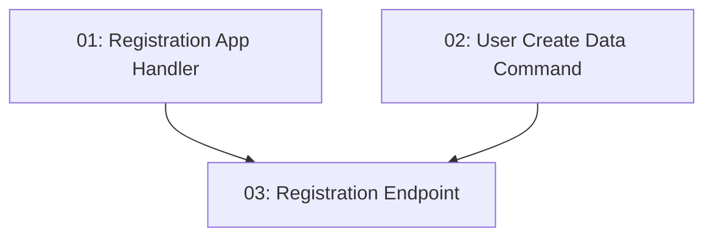

# STORY-005: User Registration — Backend

## Overview

Implements the `POST /api/auth/register` endpoint. New visitors provide name, email, and password; the system hashes the password with BCrypt and creates the user record. Returns 201 on success, 409 on duplicate email, 400 on validation failures.

## Quick Links

- [Requirements](./requirements.md)
- [Action Required](./action-required.md)

## Dependency Graph

## Phases

| Phase | Tasks | Description |
|-------|-------|-------------|
| 1 | task-01, task-02 | Application handler and data command in parallel |
| 2 | task-03 | Auth endpoint wiring both together |

## Task Status

### Phase 1
- [ ] [task-01-registration-handler](./tasks/task-01-registration-handler.md) — RegisterUser application request/handler
- [ ] [task-02-user-create-command](./tasks/task-02-user-create-command.md) — CreateUser data command with BCrypt

### Phase 2
- [ ] [task-03-registration-endpoint](./tasks/task-03-registration-endpoint.md) — POST /api/auth/register endpoint
