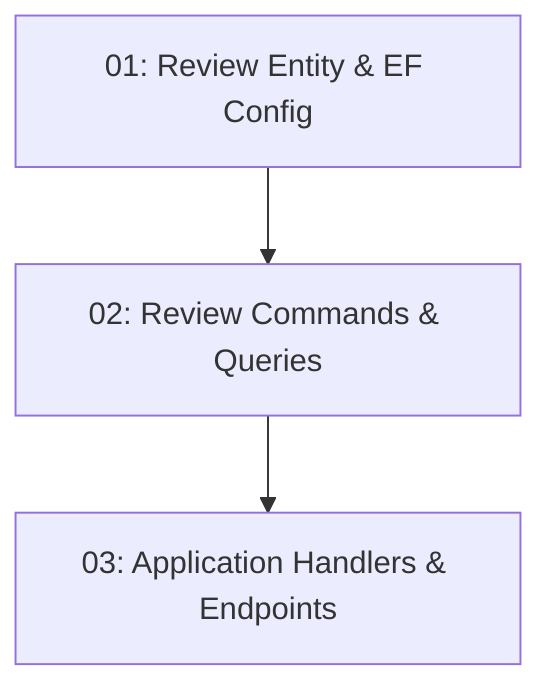

# STORY-023: User Reviews — Backend

## Overview

Allows authenticated users to submit star ratings (1–5) and text reviews for restaurants. Implements `POST /api/restaurants/{id}/reviews` and `GET /api/restaurants/{id}/reviews` (paginated, newest first).

## Quick Links

- [Requirements](./requirements.md)
- [Action Required](./action-required.md)

## Dependency Graph

## Phases

| Phase | Tasks | Description |
|-------|-------|-------------|
| 1 | task-01 | Review domain entity and EF migration |
| 2 | task-02 | Data commands and queries |
| 3 | task-03 | Application handlers and endpoints |

## Task Status

### Phase 1
- [ ] [task-01-review-entity](./tasks/task-01-review-entity.md) — Review entity, EF config, migration

### Phase 2
- [ ] [task-02-review-commands](./tasks/task-02-review-commands.md) — CreateReview command + GetReviews query

### Phase 3
- [ ] [task-03-review-endpoints](./tasks/task-03-review-endpoints.md) — Application handlers + endpoints
