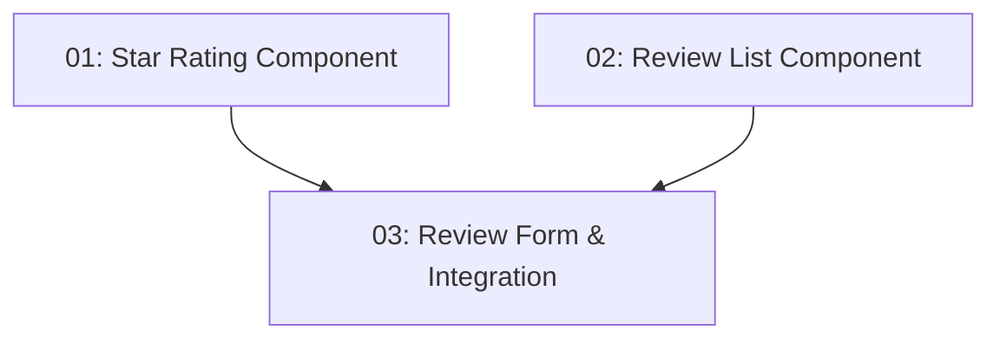

# STORY-024: User Reviews — Frontend

## Overview

Adds a reviews section to the restaurant detail page. Authenticated users see a submission form (star rating + text). New reviews appear immediately in the list without a page reload.

## Quick Links

- [Requirements](./requirements.md)
- [Action Required](./action-required.md)

## Dependency Graph

## Phases

| Phase | Tasks | Description |
|-------|-------|-------------|
| 1 | task-01, task-02 | Star rating and review list components (parallel) |
| 2 | task-03 | Review form and integration into detail page |

## Task Status

### Phase 1
- [ ] [task-01-star-rating](./tasks/task-01-star-rating.md) — Interactive star rating input
- [ ] [task-02-review-list](./tasks/task-02-review-list.md) — Review list component

### Phase 2
- [ ] [task-03-review-form](./tasks/task-03-review-form.md) — Review submission form + detail page integration
