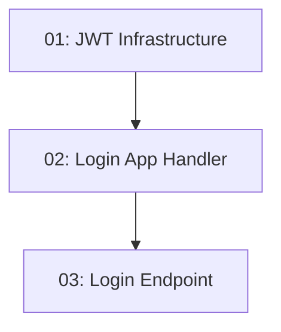

# STORY-006: User Sign-In — Backend

## Overview

Implements `POST /api/auth/login`. Valid credentials return a JWT with `userId`, `email`, and `role` claims. Invalid credentials return 401 with no field-level detail. The JWT secret comes from configuration, never source code.

## Quick Links

- [Requirements](./requirements.md)
- [Action Required](./action-required.md)

## Dependency Graph

## Phases

| Phase | Tasks | Description |
|-------|-------|-------------|
| 1 | task-01 | JWT options and token generation service |
| 2 | task-02 | Login application handler using JWT service |
| 3 | task-03 | Login endpoint wiring handler |

## Task Status

### Phase 1
- [ ] [task-01-jwt-infrastructure](./tasks/task-01-jwt-infrastructure.md) — JwtOptions + JwtTokenGenerator

### Phase 2
- [ ] [task-02-login-handler](./tasks/task-02-login-handler.md) — Login request/response/handler

### Phase 3
- [ ] [task-03-login-endpoint](./tasks/task-03-login-endpoint.md) — POST /api/auth/login endpoint
